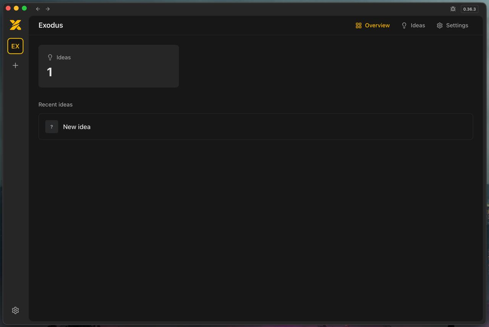

Exodus enables product evolution through controlled iterations, where user intent stabilizes, decisions centralize, execution isolates, and state remains consistent without degradation between steps.

<p align="center">
  
</p>

<p align="center">
  <a href="https://github.com/sygeman/exodus/releases/latest/download/stable-macos-arm64-Exodus.dmg">
    
  </a>
</p>

## Installation

### macOS

1. Download [**Exodus.dmg**](https://github.com/sygeman/exodus/releases/latest/download/stable-macos-arm64-Exodus.dmg) (Apple Silicon)
2. Open the file and drag **Exodus** into the **Applications** folder
3. Run in Terminal to remove the quarantine attribute:
   ```bash
   xattr -cr /Applications/Exodus.app
   ```

### Linux

```bash
curl -fsSL https://raw.githubusercontent.com/sygeman/exodus/main/scripts/install-linux.sh | bash
```

After installation the app is available in the applications menu and via the `exodus` command in the terminal.

### Uninstall

#### macOS

```bash
rm -rf /Applications/Exodus.app
```

#### Linux

```bash
curl -fsSL https://raw.githubusercontent.com/sygeman/exodus/main/scripts/uninstall-linux.sh | bash
```
